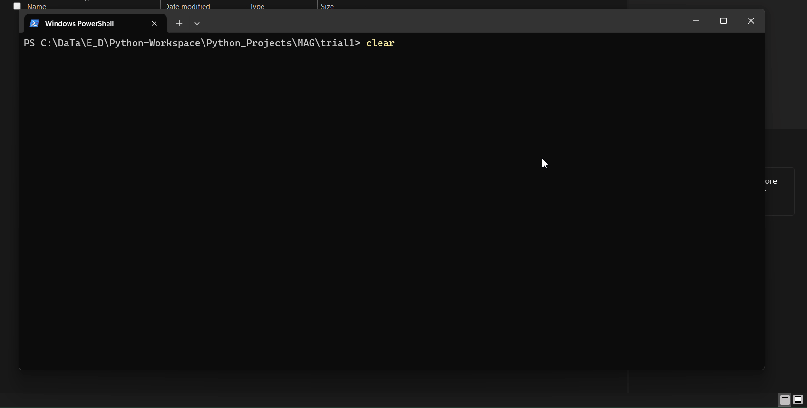

# MAG 'Markdown Article Generator" 
MAG is article generator which generate markdown files with name post{number}.md where number can varry from 1 to as many as user wanted.

Variables like month_names, year_range, title and tags can be modified as per the user.

## Here is how script works:
