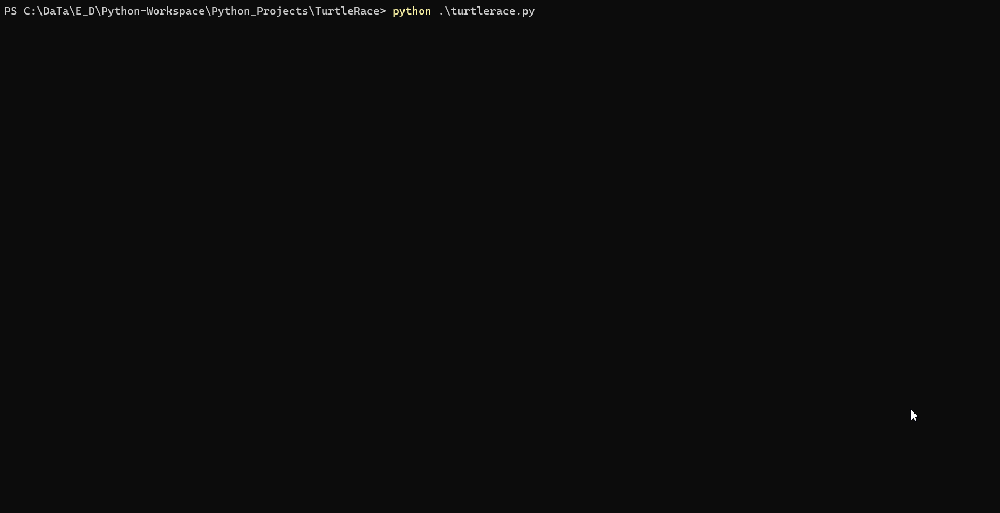

# Turtle Racing
Turtle racing is a game where a user asked to enter a number of turtles they want to run after that race happens and the fastest turtle wins the race.
The whole program is made of python and Tkinter.

## Turtle Module
A turtle module is built in python, and it allow user to basic 2d graphic operation with things called as turtle. It's like little header on the screen, it draw lines.
Turtle racing uses a resolution of 500x500. The very middle of the game canvas is 0, 0 which means the top of canvas has 250, bottom of canvas has -250, right has the canvas -250 and the left of canvas has 250.

When turtle run on the screen than it leaves a line which is called pen.
To remove the residue line by using '.penup' property.

Turtle run on x direction the fastest turtle wins the race. 

Here is how the game works:
